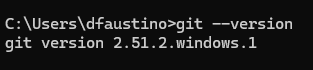
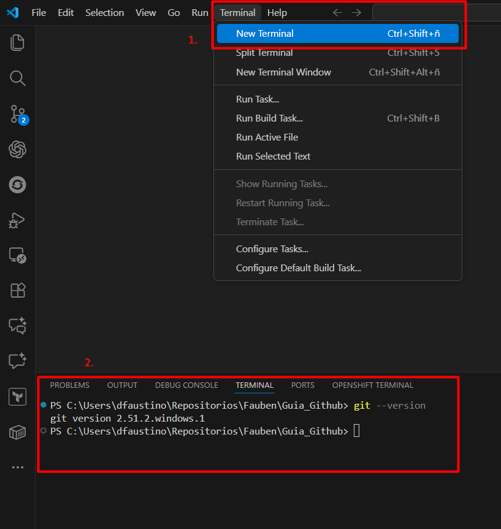
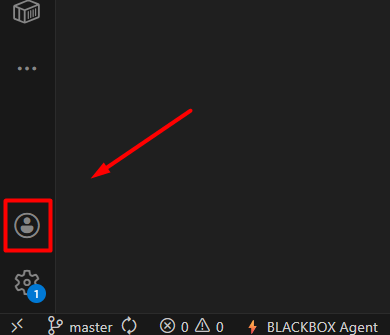

# Guía para vincular Visual Studio Code con GitHub

## Indice

- Prerrequisitos
- [Git](#git)
    - [Descarga]
    - [Instalación]
    - [Configuración]
- [Visual Studio Code](#visual-studio-code)
    - Descarga
    - Instalación
    - Uso
- Consejos

---

### Prerrequisitos
- Cuenta activa en GitHub.
- Git instalado y disponible en la terminal.
- Visual Studio Code instalado

---

### Git 

#### Instalación de Git
1) Descarga: entra en [git-scm.com/downloads](https://git-scm.com/downloads) y elige tu sistema operativo.
2) Instalador (Windows): acepta opciones por defecto; si preguntas sobre el editor, puedes dejar “VS Code”.
3) Comprobación: abre una terminal y ejecuta `git --version` para confirmar que quedó instalado.


     

#### Configuración básica de Git

- Abre la consola de Git, busca 'Git Bash' y ejecutalo.

- Luego en la consola usa los comandos:

```bash
git config --global user.name "Tu Nombre"
git config --global user.email "tu-correo@dominio.com"
```

- Donde:
    - `"Tu Nombre"` es el nombre de usuario de GitHub.
    - `"tu-correo@dominio.com"` es el correo de Github.

> [!WARNING]
    Se debe dejar el entrecomillado para ambos campos.

---

### Visual Studio Code

#### Instalación de VS Code

##### Descarga del Software
[Link de Descarga (Visual Studio Code)](https://code.visualstudio.com/)

##### Instalación del Software
1) Ejecuta el .exe (Windows) o el paquete adecuado (macOS/Linux) y acepta las opciones por defecto. Marca “Add to PATH” en Windows para usar `code` desde la terminal.

3) Arranque: abre VS Code y confirma que la terminal integrada reconoce `git --version`.

    

### Conectar VS Code con GitHub (desde la interfaz de VS Code)
1) Abre el panel de Control de Código Fuente (icono de ramas en la barra lateral).

    

2) Inicia sesión con GitHub usando la UI: botón “Sign in to GitHub”. Sigue el flujo del navegador y permite el inicio de sesión directo en VS Code.
3) Verifica que en la esquina inferior izquierda aparece tu usuario de GitHub conectado.

